<!-- ============================================================
     SECTION: Header (banner + typing intro)
     Self-contained. Depends only on assets/banner/header-banner.svg.
     ============================================================ -->

  

<h1 align="center">
  Umair Asfar – Junior Full Stack Developer
</h1>

  

📍 Sri Lanka

<!-- ============================================================
     END SECTION: Header
     ============================================================ -->

<!-- ============================================================
     SECTION: Navigation
     Pure Markdown — no HTML needed for a simple link row.
     ============================================================ -->

  <a href="#about">About</a> ·
  <a href="#focus">Current Focus</a> ·
  <a href="#principles">Principles</a> ·
  <a href="#tech-stack">Tech Stack</a> ·
  <a href="#stats">Stats</a> ·
  <a href="#contributions">Contributions</a> ·
  <a href="#projects">Projects</a> ·
  <a href="#connect">Connect</a>

  

<!-- ============================================================
     END SECTION: Navigation
     ============================================================ -->

---

<!-- ============================================================
     SECTION: About Me
     Self-contained. No dependencies on other sections.
     ============================================================ -->

## 👋 About Me

- 💼 Junior Full Stack Developer focused on building reliable, production-grade web applications
- 📍 Based in Sri Lanka
- 🌱 Currently deepening my skills in AI-assisted software engineering
- 🎯 Open to remote Software Engineering opportunities
- 🛠️ Comfortable across the stack — interface, API, and database

More about how I work

 

I care about code that stays easy to read, test, and change months after it
was written. I favor simple, well-named solutions over clever ones, and treat
performance, accessibility, and scalability as requirements rather than
afterthoughts.

<!-- ============================================================
     END SECTION: About Me
     ============================================================ -->

---

<!-- ============================================================
     SECTION: Current Focus
     Self-contained. Pure Markdown.
     ============================================================ -->

## 🎯 Current Focus

- 🏗️ Building production-grade web applications, end to end
- 🤖 Learning AI-assisted software engineering
- 📡 Open to remote Software Engineering opportunities

<!-- ============================================================
     END SECTION: Current Focus
     ============================================================ -->

---

<!-- ============================================================
     SECTION: Development Principles
     Self-contained. Pure Markdown.
     ============================================================ -->

## 🧭 Development Principles

- 🧹 **Clean Code** — readable, well-structured, self-explanatory
- ⚡ **Performance** — fast by default, measured rather than assumed
- ♿ **Accessibility** — usable interfaces for everyone
- 📈 **Scalable Architecture** — systems designed to grow without breaking
- 📚 **Continuous Learning** — always improving, always iterating

<!-- ============================================================
     END SECTION: Development Principles
     ============================================================ -->

---

<!-- ============================================================
     SECTION: Tech Stack
     Self-contained. Each row is one image call, grouped by category.
     Edit the `i=` query param on skillicons.dev to add/remove icons.
     ============================================================ -->

## 🛠️ Tech Stack

**Languages**

  

**Frontend**

  

**Backend**

  
  

**Database**

  
  

**Tools**

  
  
  

<!-- ============================================================
     END SECTION: Tech Stack
     ============================================================ -->

---

<!-- ============================================================
     SECTION: GitHub Stats
     Self-contained. Replace `umairasfar01` if the username changes.
     ============================================================ -->

## 📊 GitHub Stats

  
  

  

<!-- ============================================================
     END SECTION: GitHub Stats
     ============================================================ -->

---

<!-- ============================================================
     SECTION: Contribution Activity (snake + activity graph)
     Self-contained. The snake images only exist once
     .github/workflows/snake.yml has run at least once on GitHub —
     until then those two images will show as broken.
     ============================================================ -->

## 🐍 Contribution Activity

  <picture>
    <source
      media="(prefers-color-scheme: dark)"
      srcset="https://raw.githubusercontent.com/umairasfar01/umairasfar01/output/snake-dark.svg">
    <source
      media="(prefers-color-scheme: light)"
      srcset="https://raw.githubusercontent.com/umairasfar01/umairasfar01/output/snake-light.svg">
    
  </picture>

  

<!-- ============================================================
     END SECTION: Contribution Activity
     ============================================================ -->

---

<!-- ============================================================
     SECTION: Featured Projects
     Each project is one self-contained block. Copy the block
     between the markers below to add another project.
     ============================================================ -->

## 🚀 Featured Projects

<!-- PROJECT CARD START -->

### Agent Knowledge Management

Production-ready SaaS platform for managing AI agent knowledge — covering
organizations, role-based permissions, audit logs, version history,
retrieval, and collaboration.

  
  
  
  

**Key achievements**

- Role-based organization management
- Audit logs
- Knowledge version history
- Retrieval history
- Modern SaaS architecture

<!-- PROJECT CARD END -->

---

<!-- PROJECT CARD START -->

### 🔜 Coming Soon

Another project write-up will go here.

<!-- PROJECT CARD END -->

---

<!-- PROJECT CARD START -->

### 🔜 Coming Soon

Another project write-up will go here.

<!-- PROJECT CARD END -->

<!-- ============================================================
     END SECTION: Featured Projects
     ============================================================ -->

---

<!-- ============================================================
     SECTION: Connect
     Self-contained. Replace the LinkedIn and email placeholders.
     ============================================================ -->

## 📫 Connect With Me

  
  

<!-- ============================================================
     END SECTION: Connect
     ============================================================ -->

  

  <a href="#top">⬆ Back to top</a>

